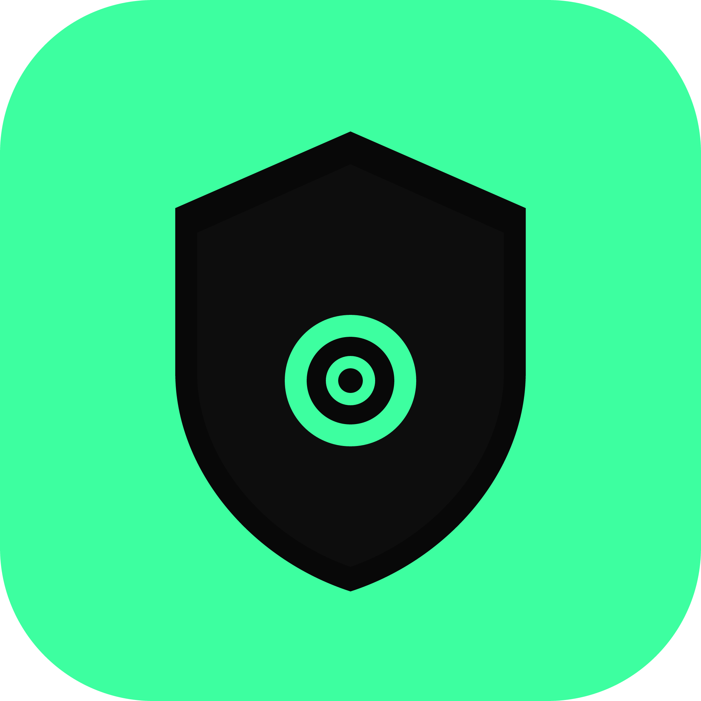

<p align="center">
  
</p>

<h1 align="center">Vigil</h1>

<p align="center">
  <strong>Stablecoin Wallet Watchdog</strong><br/>
  Real-time wallet monitoring, risk scoring, and contagion analysis — powered by <a href="https://range.org">Range</a>.
</p>

<p align="center">
  <em>Range protects institutions. Vigil protects you.</em>
</p>

---

## What is Vigil?

Vigil is a mobile app that monitors stablecoin wallets across multiple blockchains in real time. Add wallet addresses, set alert preferences, and get notified instantly when transactions are detected — with risk context you can actually act on.

**Key features:**

- **Multi-chain monitoring** — Ethereum, Solana, Tron, Cosmos Hub, Osmosis, and Stellar
- **Contagion Score** — Maps your wallet's transaction graph, risk-scores all counterparties, and returns a neighborhood contamination score with a visual graph
- **Act Now Mode** — When HIGH/CRITICAL alerts fire, surfaces contextual emergency action cards — not just a notification
- **SafeSend** — Pre-flight risk check before you send funds to an unknown address
- **Push + Email alerts** — Expo push notifications and Resend email delivery

## Tech Stack

| Layer | Tech |
|-------|------|
| Mobile | Expo (React Native) + TypeScript |
| Backend | Node.js + Express + SQLite (better-sqlite3) |
| Notifications | Expo Push + Resend email |
| Blockchain Data | [Range MCP API](https://range.org) |

## Project Structure

```
vigil/
├── backend/
│   ├── index.js           # Express server + REST routes
│   ├── db.js              # SQLite schema + helpers
│   ├── poller.js          # Background polling loop
│   ├── range.js           # Range MCP API client
│   ├── contagion.js       # Contagion score engine
│   ├── alerts.js          # Push + email + Act Now logic
│   └── seed.js            # Demo data seeder
├── mobile/
│   ├── app/(tabs)/
│   │   ├── index.tsx      # Wallets tab
│   │   ├── alerts.tsx     # Alert history feed
│   │   └── safesend.tsx   # SafeSend risk checker
│   └── components/
│       ├── WalletCard.tsx
│       ├── AlertItem.tsx
│       ├── ContagionGraph.tsx
│       ├── ActNowCard.tsx
│       ├── NetworkChips.tsx
│       └── RiskBadge.tsx
```

## Getting Started

### Prerequisites

- Node.js 18+
- [Expo CLI](https://docs.expo.dev/get-started/installation/)
- A [Range API key](https://range.org)
- A [Resend API key](https://resend.com) (for email alerts)

### Backend

```bash
cd vigil/backend
npm install
```

Create a `.env` file:

```env
RANGE_API_KEY=your_range_api_key
RESEND_API_KEY=your_resend_api_key
RESEND_FROM_EMAIL=vigil@yourdomain.com
PORT=3000
POLL_INTERVAL_SECONDS=60
```

Start the server:

```bash
npm run dev
```

### Mobile

```bash
cd vigil/mobile
npm install
```

Create a `.env` file:

```env
EXPO_PUBLIC_API_URL=http://localhost:3000
```

Start Expo:

```bash
npx expo start
```

Scan the QR code with Expo Go on your device, or press `i` for iOS simulator / `a` for Android emulator.

> **Note:** Push notifications require a physical device — they won't work in the simulator.

## Supported Networks

| Network | ID |
|---------|----|
| Ethereum | `ethereum` |
| Solana | `solana` |
| Tron | `tron` |
| Cosmos Hub | `cosmoshub-4` |
| Osmosis | `osmosis-1` |
| Stellar | `stellar` |

## Design

Dark theme with accent green. Built with custom fonts:

- **Syne 800** — Headlines
- **Space Mono** — Technical/mono data
- **Inter** — Body text

| Token | Value |
|-------|-------|
| Background | `#080808` |
| Accent | `#3DFFA0` |
| Danger | `#FF3B30` |
| Warning | `#F5A623` |

## License

MIT
